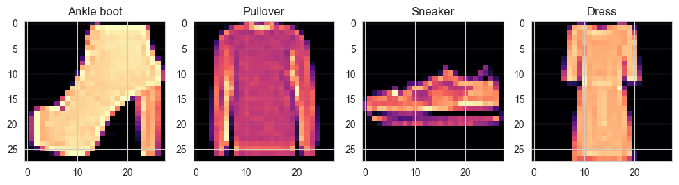

# Image-classification-CNN

This repository contains a Deep Learning project focused on image classification using Convolutional Neural Networks (CNN) with the Fashion MNIST dataset. The project demonstrates how to build a CNN model to classify images of fashion items, such as clothing and shoes.

## Used Libraries 
- `numpy`- `pandas`- `matplotlib`- `seaborn`
- `scikit-learn`- `tensorflow` - `keras`

## Run the project 

The repository includes a Jupyter notebook which you can run on your local machine or use Google Colab.

## Results 
The model predicts a label for an output image (classification task).  
Here's a sample of what the results might look like:

You can find the complete results and analysis in the Jupyter notebook.

## Acknowledgements

- This project is part of ML bootcamp provided by <a href="https://clarusway.com/"> Clarusway</a>.
- We make use of the Fashion MNIST dataset, which is a publicly available dataset for image classification originally created by Han Xiao.
